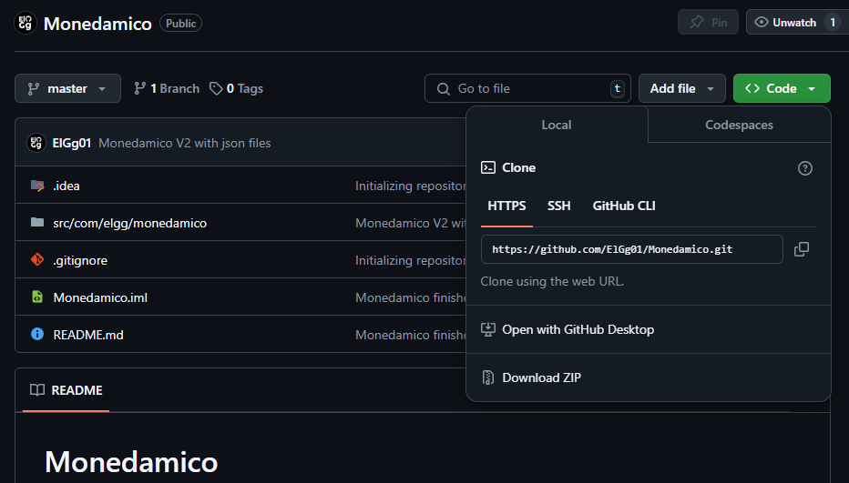
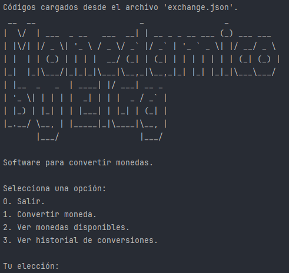
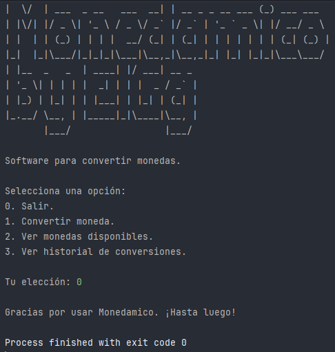
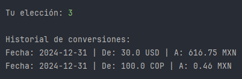

# 🪙 Monedamico 🪙

Monedamico es un proyecto desarrollado en Java que permite conversiones entre distintas monedas de manera dinámica adaptándose al cambio actual. El nombre viene de **Moneda** y **dinámico** haciendo referencia a que las monedas pueden variar dependiendo el tipo de cambio.

## 🚀 Inicio:

Para obtener una copia de este proyecto pulsa en el botón verde **(<> Code)** y posteriormente puedes obtenerlo de distintas formas, de las cuales solo se explicarán 2:



1. Pulsa al botón **Download ZIP**.
   1. Descomprime el ZIP.
2. Copia el enlace HTTPS: https://github.com/ElGg01/Monedamico.git
   1. Abre una terminal de comandos en tu sistema operativo.
   2. Teniendo git instalado ejecuta el siguiente comando:
   ```bash
   git clone https://github.com/ElGg01/Monedamico.git
    ```

## 📋 Prerequisitos:

- ☕ Java:
  - Versión minima necesaria: Desconocida.
  - Versión de desarrollo: JDK 23.0.1.
- 📚 Librerias de Java:
  - Gson:
    - Versión: 2.11.0
  - Dotenv:
    - Versión: 3.1.0
- Cuenta en https://app.exchangerate-api.com/.
  - API_KEY

## 🔧 Instalación:

1. Descarga o clona el proyecto.
2. Agrega las dependencias listadas en los **prerequisitos**.
3. Crea un archivo en la raíz del proyecto llamado **".env"**.
4. Dentro escribe **API_KEY=[TU_KEY]** y sustituye **[TU_KEY]** por tu API_KEY de https://app.exchangerate-api.com/.
5. Ejecutar el archivo Main.

## 💵 Modo de uso:

Al ejecutar el programa verás una pantalla como esta:


En la cual podrás elegir varías opciones listadas a continuación:
0. **Salir del programa:** Cierra el programa.


1. **Convertir moneda:** Permite elegir una moneda, un monto de esa moneda y la moneda de destino para convertir. Al final regresa el resultado de la conversión y la guarda en un historial, el cual es un archivo json.


2. **Ver monedas disponibles:** Muestra una lista de las monedas permitirdas por la API para convertir.


3. **Ver historial de conversiones:** Permite ver el historial de todas las conversiones que se han hecho, mismas que se guardan en un archivo json.



## 👀 Cosas a tener en cuenta:
- Es necesario contar con conexión a internet.
- Los códigos de moneda son almacenados en un archivo JSON para evitar llamar a la API tantas veces.
- El historial se almancena en un archivo JSON.
- Para poder hacer una conversión debe hacerse con códigos de monedas validas que esten disponibles en la API.

## Licencia:
Este proyecto está bajo la licencia MIT. Puedes ver más detalles en el archivo LICENSE.

[MIT LICENSE](LICENSE)

## ✨ Agredecimiento:
Agradezco a Alura Latam por la formación y apoyo brindados en el desarrollo de este proyecto.